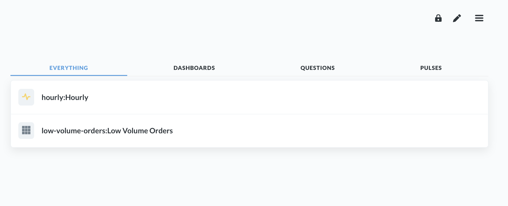
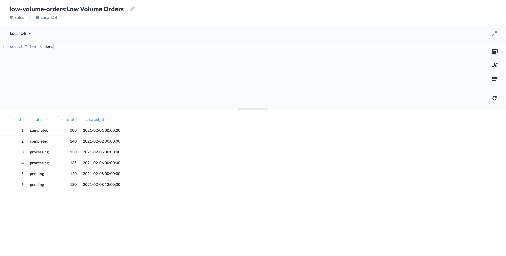
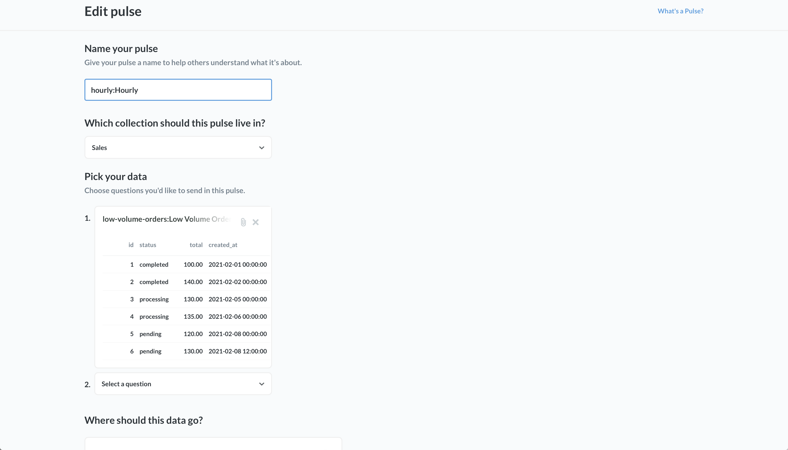

# MetabaseQuerySync

MetabaseQuerySync is a tool for automatically syncing metabase queries defined in files to a specific metabase installation.

This enables metabase queries to be maintained with the relevant source code to ease refactoring of models in your application.

## Installation

Add this line to your application's Gemfile:

```ruby
gem 'metabase_query_sync'
```

And then execute:

    $ bundle install

Or install it yourself as:

    $ gem install metabase-query-sync

## Usage

Build files with `.query.yaml` or `.pulse.yaml` suffix and sync those files up to your metabase instance.

### Files Definitions

```yaml
# in low-volume-orders.query.yaml
name: Low Volume Orders
sql: 'select * from orders'
database: Local DB # must match name of database in metabase
pulse: hourly # must match local pulse id (name of file), throws exception if no pulse is found with that name
```

```yaml
# in hourly.pulse.yaml
name: Hourly
alerts:
  - type: email # can be one of slack/email
    email:
      emails: ['ragboyjr@icloud.com']
    # or instead
    #slack:
    #  channel: '#test-channel'
    schedule:
      type: hourly # can be one of hourly, daily, weekly
      hour: 5 # number from 0-23, only needed if daily or weekly
      day: mon # first 3 character of day only needed if weekly
```

### Understanding Ids

Every metabase model defined in a file has an id which defaults to the name of the file minus the query/pulse.yaml suffix. An id can be explicitly set in the file if wanted. All references within files to other files must use the id of the item to reference.

Given the following folder layout:

```
queries/
  low-volume.query.yaml
  catalog/
    products-missing-images.query.yaml
  hourly.pulse.yaml
```

The generated ids would be:

```
low-volume
catalog/products-missing-images
hourly
```

### Running the Sync

Then using the metabase-query-sync cli tool, you can sync those files directly into metabase:

```bash
Command:
  metabase-query-sync s

Usage:
  metabase-query-sync s ROOT_COLLECTION_ID [PATHS]

Description:
  Sync queries/pulses to your metabase root collection

Arguments:
  ROOT_COLLECTION_ID  	# REQUIRED The root collection id to sync all items under.
  PATHS               	# The paths to metabase item files to sync from. Support for scoped paths with custom_name:/path/to/folder is supported as well to ensure each imported item is scoped with custom_name.

Options:
  --[no-]dry-run, -d              	# Perform a dry run and do not actually sync to the metabase instance., default: false
  --host=VALUE, -H VALUE          	# Metabase Host, if not set, will read from env at METABASE_QUERY_SYNC_HOST
  --user=VALUE, -u VALUE          	# Metabase User, if not set, will read from env at METABASE_QUERY_SYNC_USER
  --pass=VALUE, -p VALUE          	# Metabase Password, if not set, will read from env at METABASE_QUERY_SYNC_PASS
  --config-file=VALUE, -f VALUE   	# explicit path to .metabase-query-sync.erb.yaml file in case its not in the working directory
  --help, -h                      	# Print this help
```

### Using .metabase-query-sync.erb.yaml

It's nice to configure the different paths to search for at once instead of configuring into the command each time, and for that, we support setting defalt config in a file named `.metabase-query-sync.yaml` which should be in the same working directory of the command executation.

Here's an example file:

```yaml
credentials:
  host: http://metabase:3000
  user: ragboyjr@icloud.com
  pass: <%= ENV["METABASE_PASS"] %>
paths:
  - 'sales:app/sales/queries'
  - 'catalog:app/catalog/queries'
```

### Results in Metabase

Navigating to metabase under the root collection provided, should show the synced queries and pulses!





## Development

- Install gems with `bundle install`
- Run tests with `bundle exec rspec`


### Debugging with Metabase

To setup the local data source for metabase, run `make db`.

Starting the metabase docker container should automatically initialize an empty metabase installation with the main admin user account (ragboyjr@icloud.com / password123).

## Roadmap

- Support syncing from multiple paths with id prefixes
  - e.g. /path-to-sales-queries:sales /path-to-payment-queries:payment
- Support `.metabase-query-sync.erb.yaml` configuration file

## Contributing

Bug reports and pull requests are welcome on GitHub at https://github.com/ragboyjr/metabase-query-sync. This project is intended to be a safe, welcoming space for collaboration, and contributors are expected to adhere to the [code of conduct](https://github.com/ragboyjr/metabase-query-sync/blob/master/CODE_OF_CONDUCT.md).

## License

The gem is available as open source under the terms of the [MIT License](https://opensource.org/licenses/MIT).

## Code of Conduct

Everyone interacting in the Metabase::Query::Sync project's codebases, issue trackers, chat rooms and mailing lists is expected to follow the [code of conduct](https://github.com/ragboyjr/metabase-query-sync/blob/master/CODE_OF_CONDUCT.md).
